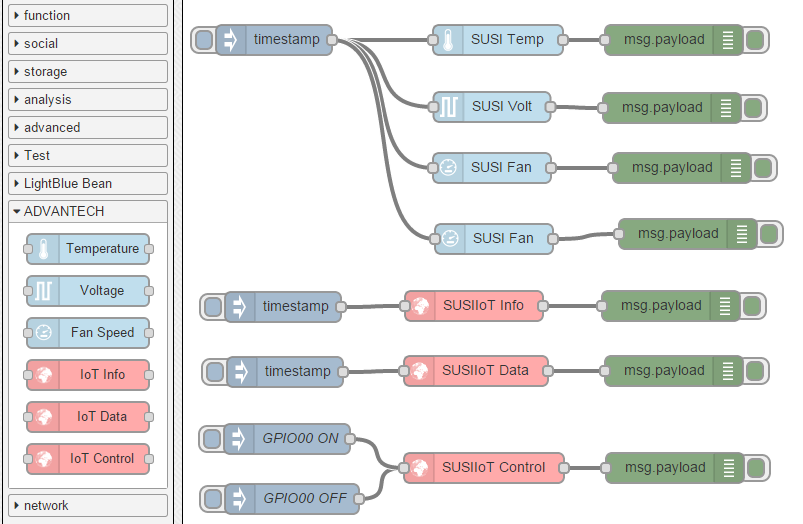

# node-red-node-susi
A collection of [Node-RED](http://nodered.org) nodes to Access ADVANTECH platform HW function by node-susiiot & node-susi.

## Install
Use npm to command to install this package locally in the Node-RED modules directory
```bash
npm install node-red-node-susi 
```
or install in it globally with the command
```bash
npm install node-red-node-susi -g 
```

## Nodes included in the package
**Temperature** Read platfom Temperature (CPU, SYS...) from node-susi.

**Voltage** Read platfom Voltage (12V, 5V...) from node-susi.

**Fan Speed** Read platfom Fan Speed (CPU, SYS...) from node-susi.

**IoT Info** Read platfom all function's Capability from node-susiiot .

**IoT Data** Read platfom function's Data from node-susiiot .

**IoT Control** Set platfom function's Data from node-susiiot .

## Usage example

Simple usage of the plugin in Node-RED, a message with ON or 1 will turn on the node, otherwise a message with OFF or 0 will turn off the node.
```json
[
  {
    "id": "7511c3cd.8aee3c",
    "type": "inject",
    "name": "",
    "topic": "",
    "payload": "",
    "payloadType": "date",
    "repeat": "",
    "crontab": "",
    "once": false,
    "x": 100,
    "y": 334,
    "z": "2395ff1f.dc6a",
    "wires": [
      [
        "7a24a0b2.85db6"
      ]
    ]
  },
  {
    "id": "e4bfce4.f1b403",
    "type": "debug",
    "name": "",
    "active": true,
    "console": "false",
    "complete": "payload",
    "x": 488,
    "y": 333,
    "z": "2395ff1f.dc6a",
    "wires": []
  },
  {
    "id": "7a24a0b2.85db6",
    "type": "SUSIIoT-Info",
    "name": "",
    "topic": "SUSIIoT Info",
    "class0": "Hardware Monitor",
    "class1HWM": "Temperature",
    "class1GPIO": "GPIO00",
    "x": 291,
    "y": 333,
    "z": "2395ff1f.dc6a",
    "wires": [
      [
        "e4bfce4.f1b403"
      ]
    ]
  },
  {
    "id": "cc303b6a.33cfc8",
    "type": "inject",
    "name": "",
    "topic": "",
    "payload": "",
    "payloadType": "date",
    "repeat": "",
    "crontab": "",
    "once": false,
    "x": 102,
    "y": 399,
    "z": "2395ff1f.dc6a",
    "wires": [
      [
        "599b4a45.a664b4"
      ]
    ]
  },
  {
    "id": "4c702b.ffb38fd4",
    "type": "debug",
    "name": "",
    "active": true,
    "console": "false",
    "complete": "payload",
    "x": 491,
    "y": 398,
    "z": "2395ff1f.dc6a",
    "wires": []
  },
  {
    "id": "599b4a45.a664b4",
    "type": "SUSIIoT-Data",
    "name": "",
    "topic": "SUSIIoT Data",
    "class0": "GPIO",
    "class1HWM": "Voltage",
    "class1GPIO": "GPIO00",
    "x": 293,
    "y": 398,
    "z": "2395ff1f.dc6a",
    "wires": [
      [
        "4c702b.ffb38fd4"
      ]
    ]
  },
  {
    "id": "bf8ecc4c.40713",
    "type": "SUSIIoT-Control",
    "name": "",
    "topic": "SUSIIoT Control",
    "class0": "Hardware Monitor",
    "class1HWM": "All",
    "class1GPIO": "All",
    "x": 301,
    "y": 495,
    "z": "2395ff1f.dc6a",
    "wires": [
      [
        "e351522a.1caeb"
      ]
    ]
  },
  {
    "id": "28a90a33.d756f6",
    "type": "inject",
    "name": "GPIO00 OFF",
    "topic": "",
    "payload": " { \"n\": \"Level\", \"bv\": 0, \"id\": 17040129 } ",
    "payloadType": "string",
    "repeat": "",
    "crontab": "",
    "once": false,
    "x": 109,
    "y": 526,
    "z": "2395ff1f.dc6a",
    "wires": [
      [
        "bf8ecc4c.40713"
      ]
    ]
  },
  {
    "id": "e351522a.1caeb",
    "type": "debug",
    "name": "",
    "active": true,
    "console": "false",
    "complete": "payload",
    "x": 492,
    "y": 495,
    "z": "2395ff1f.dc6a",
    "wires": []
  },
  {
    "id": "37f5a3b6.c80a5c",
    "type": "inject",
    "name": "GPIO00 ON",
    "topic": "",
    "payload": " { \"n\": \"Level\", \"bv\": 1, \"id\": 17040129 } ",
    "payloadType": "string",
    "repeat": "",
    "crontab": "",
    "once": false,
    "x": 104,
    "y": 466,
    "z": "2395ff1f.dc6a",
    "wires": [
      [
        "bf8ecc4c.40713"
      ]
    ]
  },
  {
    "id": "156af1fe.ea950e",
    "type": "inject",
    "name": "",
    "topic": "",
    "payload": "",
    "payloadType": "date",
    "repeat": "",
    "crontab": "",
    "once": false,
    "x": 91,
    "y": 67,
    "z": "2395ff1f.dc6a",
    "wires": [
      [
        "f772f4e1.088d08",
        "cbb32fb.f344cd",
        "c20d410e.3df2c",
        "acd67c32.53298"
      ]
    ]
  },
  {
    "id": "3ef17d87.c10e82",
    "type": "debug",
    "name": "",
    "active": true,
    "console": "false",
    "complete": "payload",
    "x": 491,
    "y": 67,
    "z": "2395ff1f.dc6a",
    "wires": []
  },
  {
    "id": "f772f4e1.088d08",
    "type": "SUSI-Temp",
    "name": "",
    "topic": "SUSI Temp",
    "pin": "0",
    "x": 315,
    "y": 67,
    "z": "2395ff1f.dc6a",
    "wires": [
      [
        "3ef17d87.c10e82"
      ]
    ]
  },
  {
    "id": "904c4718.6fb3b8",
    "type": "debug",
    "name": "",
    "active": true,
    "console": "false",
    "complete": "payload",
    "x": 489,
    "y": 135,
    "z": "2395ff1f.dc6a",
    "wires": []
  },
  {
    "id": "cbb32fb.f344cd",
    "type": "SUSI-Volt",
    "name": "",
    "topic": "SUSI Volt",
    "pin": "4",
    "x": 309,
    "y": 134,
    "z": "2395ff1f.dc6a",
    "wires": [
      [
        "904c4718.6fb3b8"
      ]
    ]
  },
  {
    "id": "c20d410e.3df2c",
    "type": "SUSI-Fan",
    "name": "",
    "topic": "SUSI Fan",
    "pin": "3",
    "x": 309,
    "y": 195,
    "z": "2395ff1f.dc6a",
    "wires": [
      [
        "f316ab80.0ce958"
      ]
    ]
  },
  {
    "id": "f316ab80.0ce958",
    "type": "debug",
    "name": "",
    "active": true,
    "console": "false",
    "complete": "payload",
    "x": 499,
    "y": 195,
    "z": "2395ff1f.dc6a",
    "wires": []
  },
  {
    "id": "acd67c32.53298",
    "type": "SUSI-Fan",
    "name": "",
    "topic": "SUSI Fan",
    "pin": "1",
    "x": 311,
    "y": 266,
    "z": "2395ff1f.dc6a",
    "wires": [
      [
        "ad47140.f52b8f"
      ]
    ]
  },
  {
    "id": "ad47140.f52b8f",
    "type": "debug",
    "name": "",
    "active": true,
    "console": "false",
    "complete": "payload",
    "x": 505,
    "y": 261,
    "z": "2395ff1f.dc6a",
    "wires": []
  }
]
```

## Tested devices 

| Vendor                                               | Working | Note                                                 |
|------------------------------------------------------|-----------|---------|------------------------------------------------------|
| ADVANTECH  AIMB-582      | YES     |                                                      | 

All Advantech platform ported SUSI4 driver  should be able to support.

## History
- 0.0.1 - April 2015 : Initial Release

## Authors
* Neo Lo (https://github.com/neo7206)

## License
Licensed under the Apache License, Version 2.0 (the "License"); you may not use this file except in compliance with the License. You may obtain a copy of the License at http://www.apache.org/licenses/LICENSE-2.0. Unless required by applicable law or agreed to in writing, software distributed under the License is distributed on an "AS IS" BASIS, WITHOUT WARRANTIES OR CONDITIONS OF ANY KIND, either express or implied. See the License for the specific language governing permissions and limitations under the License.
