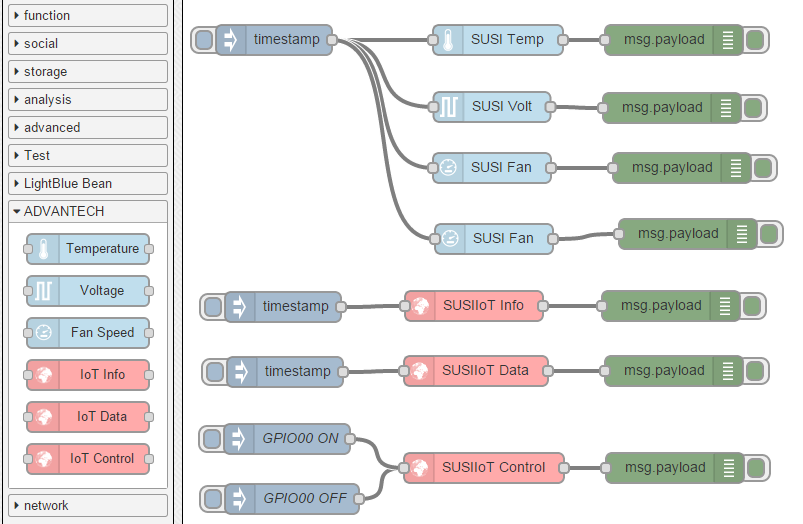

# node-red-contrib-susi
A collection of [Node-RED](http://nodered.org) nodes to Access ADVANTECH platform HW function by node-susiiot & node-susi.

## Install
Use npm to command to install this package locally in the Node-RED modules directory
```bash
npm install node-red-contrib-susi 
```
or install in it globally with the command
```bash
npm install node-red-contrib-susi -g 
```

## Nodes included in the package
**Temperature** Read platfom Temperature (CPU, SYS...) from node-susi.

**Voltage** Read platfom Voltage (12V, 5V...) from node-susi.

**Fan Speed** Read platfom Fan Speed (CPU, SYS...) from node-susi.

**IoT Info** Read platfom all function's Capability from node-susiiot .

**IoT Data** Read platfom function's Data from node-susiiot .

**IoT Control** Set platfom function's Data from node-susiiot .

## Usage example

Simple usage of the plugin in Node-RED, a message with ON or 1 will turn on the node, otherwise a message with OFF or 0 will turn off the node.
```json
[
   {
      "id":"7511c3cd.8aee3c",
      "type":"inject",
      "name":"",
      "topic":"",
      "payload":"",
      "payloadType":"date",
      "repeat":"",
      "crontab":"",
      "once":false,
      "x":100,
      "y":334,
      "z":"2395ff1f.dc6a",
      "wires":[
         [
            "7dd5bff8.822a4"
         ]
      ]
   },
   {
      "id":"e4bfce4.f1b403",
      "type":"debug",
      "name":"",
      "active":true,
      "console":"false",
      "complete":"payload",
      "x":488,
      "y":333,
      "z":"2395ff1f.dc6a",
      "wires":[

      ]
   },
   {
      "id":"cc303b6a.33cfc8",
      "type":"inject",
      "name":"",
      "topic":"",
      "payload":"",
      "payloadType":"date",
      "repeat":"",
      "crontab":"",
      "once":false,
      "x":102,
      "y":399,
      "z":"2395ff1f.dc6a",
      "wires":[
         [
            "87306503.78cf98"
         ]
      ]
   },
   {
      "id":"4c702b.ffb38fd4",
      "type":"debug",
      "name":"",
      "active":true,
      "console":"false",
      "complete":"payload",
      "x":491,
      "y":398,
      "z":"2395ff1f.dc6a",
      "wires":[

      ]
   },
   {
      "id":"28a90a33.d756f6",
      "type":"inject",
      "name":"GPIO00 OFF",
      "topic":"",
      "payload":" { \"n\": \"Level\", \"bv\": 0, \"id\": 17040129 } ",
      "payloadType":"string",
      "repeat":"",
      "crontab":"",
      "once":false,
      "x":109,
      "y":526,
      "z":"2395ff1f.dc6a",
      "wires":[
         [
            "593e8a85.a6c174"
         ]
      ]
   },
   {
      "id":"e351522a.1caeb",
      "type":"debug",
      "name":"",
      "active":true,
      "console":"false",
      "complete":"payload",
      "x":492,
      "y":495,
      "z":"2395ff1f.dc6a",
      "wires":[

      ]
   },
   {
      "id":"37f5a3b6.c80a5c",
      "type":"inject",
      "name":"GPIO00 ON",
      "topic":"",
      "payload":" { \"n\": \"Level\", \"bv\": 1, \"id\": 17040129 } ",
      "payloadType":"string",
      "repeat":"",
      "crontab":"",
      "once":false,
      "x":104,
      "y":466,
      "z":"2395ff1f.dc6a",
      "wires":[
         [
            "593e8a85.a6c174"
         ]
      ]
   },
   {
      "id":"156af1fe.ea950e",
      "type":"inject",
      "name":"",
      "topic":"",
      "payload":"",
      "payloadType":"date",
      "repeat":"",
      "crontab":"",
      "once":false,
      "x":91,
      "y":67,
      "z":"2395ff1f.dc6a",
      "wires":[
         [
            "71d5d988.8e2a28",
            "401306eb.bfecf8",
            "d97b8119.26848",
            "267a0728.d985f8"
         ]
      ]
   },
   {
      "id":"3ef17d87.c10e82",
      "type":"debug",
      "name":"",
      "active":true,
      "console":"false",
      "complete":"payload",
      "x":491,
      "y":67,
      "z":"2395ff1f.dc6a",
      "wires":[

      ]
   },
   {
      "id":"904c4718.6fb3b8",
      "type":"debug",
      "name":"",
      "active":false,
      "console":"false",
      "complete":"payload",
      "x":489,
      "y":135,
      "z":"2395ff1f.dc6a",
      "wires":[

      ]
   },
   {
      "id":"f316ab80.0ce958",
      "type":"debug",
      "name":"",
      "active":false,
      "console":"false",
      "complete":"payload",
      "x":499,
      "y":195,
      "z":"2395ff1f.dc6a",
      "wires":[

      ]
   },
   {
      "id":"ad47140.f52b8f",
      "type":"debug",
      "name":"",
      "active":false,
      "console":"false",
      "complete":"payload",
      "x":493,
      "y":255,
      "z":"2395ff1f.dc6a",
      "wires":[

      ]
   },
   {
      "id":"7dd5bff8.822a4",
      "type":"SUSIIoT-Info",
      "name":"",
      "topic":"SUSIIoT Info",
      "class0":"Hardware Monitor",
      "class1HWM":"All",
      "class1GPIO":"All",
      "x":282,
      "y":338,
      "z":"2395ff1f.dc6a",
      "wires":[
         [
            "e4bfce4.f1b403"
         ]
      ]
   },
   {
      "id":"87306503.78cf98",
      "type":"SUSIIoT-Data",
      "name":"",
      "topic":"SUSIIoT Data",
      "class0":"Hardware Monitor",
      "class1HWM":"All",
      "class1GPIO":"All",
      "x":287,
      "y":399,
      "z":"2395ff1f.dc6a",
      "wires":[
         [
            "4c702b.ffb38fd4"
         ]
      ]
   },
   {
      "id":"593e8a85.a6c174",
      "type":"SUSIIoT-Control",
      "name":"",
      "topic":"SUSIIoT Control",
      "class0":"Hardware Monitor",
      "class1HWM":"All",
      "class1GPIO":"All",
      "x":299,
      "y":495,
      "z":"2395ff1f.dc6a",
      "wires":[
         [
            "e351522a.1caeb"
         ]
      ]
   },
   {
      "id":"71d5d988.8e2a28",
      "type":"SUSI-Temp",
      "name":"",
      "topic":"SUSI Temp",
      "pin":0,
      "x":328,
      "y":69,
      "z":"2395ff1f.dc6a",
      "wires":[
         [
            "3ef17d87.c10e82"
         ]
      ]
   },
   {
      "id":"401306eb.bfecf8",
      "type":"SUSI-Volt",
      "name":"",
      "topic":"SUSI Volt",
      "pin":0,
      "x":324,
      "y":135,
      "z":"2395ff1f.dc6a",
      "wires":[
         [
            "904c4718.6fb3b8"
         ]
      ]
   },
   {
      "id":"d97b8119.26848",
      "type":"SUSI-Fan",
      "name":"",
      "topic":"SUSI Fan",
      "pin":0,
      "x":325,
      "y":199,
      "z":"2395ff1f.dc6a",
      "wires":[
         [
            "f316ab80.0ce958"
         ]
      ]
   },
   {
      "id":"267a0728.d985f8",
      "type":"SUSI-Fan",
      "name":"",
      "topic":"SUSI Fan",
      "pin":0,
      "x":326,
      "y":254,
      "z":"2395ff1f.dc6a",
      "wires":[
         [
            "ad47140.f52b8f"
         ]
      ]
   }
]
```

## Tested devices 

| Vendor                                               | Working | Note                                                 |
|------------------------------------------------------|-----------|---------|------------------------------------------------------|
| ADVANTECH  AIMB-582      | YES     |                                                      | 

All Advantech platform ported SUSI4 driver  should be able to support.

## History
- 0.0.1 - April 2015 : Initial Release

## Authors
* Neo Lo (https://github.com/neo7206)

## License
Copyright 2014, 2015 ADVANTECH Corp. under [the Apache 2.0 license](LICENSE).
